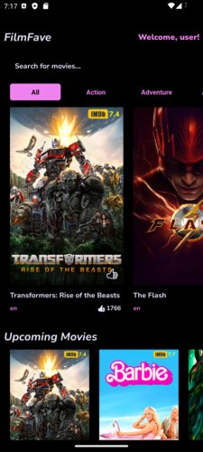
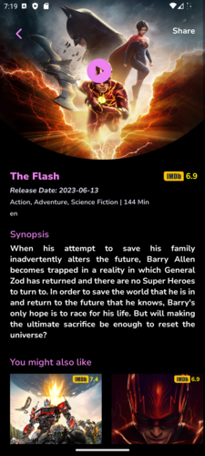

# FilmFave App

FilmFave is a mobile application built with React Native that allows users to discover and explore their favorite movies and TV shows. It provides information about now playing movies, upcoming movies, and on-the-air TV shows. Users can view details of individual movies and TV shows, including their synopsis, ratings, and genres. The app also allows users to watch trailers of movies and share their favorite content with friends. Additionally, users can give ratings to movies and TV shows, enabling them to express their opinions and help others in their entertainment choices.

 

## Features

- View Now Playing Movies: Get a list of currently playing movies and their details.
- Upcoming Movies: Explore upcoming movie releases and their information.
- On-The-Air TV Shows: Discover TV shows that are currently on the air.
- Movie Details: View in-depth information about individual movies, including synopsis, ratings, release date and genres.
- Watch Trailers: Watch trailers of movies to get a glimpse of their content.
- Rate Movies and TV Shows: Express your opinions by giving ratings to movies and TV shows.
- Share Content: Share your favorite movies and TV shows with friends.

## Installation

1. Download the APK file from [Google Drive] <https://drive.google.com/file/d/1F9lssFKup2emlyo080BEczIvXJoE3VS7/view?usp=sharing>
2. Install the APK on your Android device by opening the file.
3. Allow installation from unknown sources if prompted.

## Technologies Used

- React Native
- Expo
- Axios

## API

FilmFave uses the [The Movie Database (TMDb) API](https://www.themoviedb.org/documentation/api) to fetch movie and TV show data.

## Contributing

Contributions are welcome! If you have any bug fixes, enhancements, or new features to add, please submit a pull request.

### Conclusion

FilmFave is a testament to my progress and proficiency in React Native development. The app showcases my ability to work with APIs, implement navigation, design intuitive UI components, and manage app state effectively. It also reflects my commitment to continuous learning and improving my skills as a mobile app developer. I am excited to further enhance and expand the app's features in the future, while also exploring new technologies and best practices to deliver even more compelling mob

## Contact

If you have any questions or need further assistance, you can contact me at <ashfaq601230@gmail.com>

---
